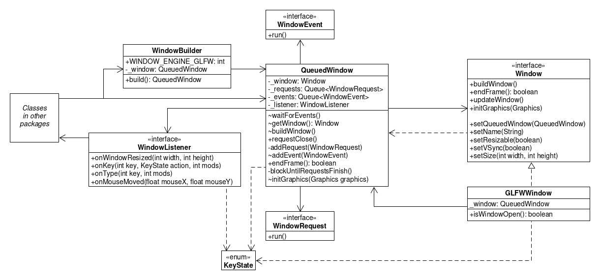
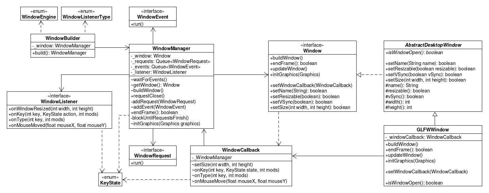

# Report for assignment 4
## Project

Name: WraithEngine3

URL: https://github.com/Wraithaven/WraithEngine3

WraithEngine is a Java-based game engine, developed by Wraithaven Games,
built around the concept of mixing various plugins to make games.

## Selected issue(s)

Title: Refactor window management

URL: https://github.com/Wraithaven/WraithEngine3/issues/22

We contacted the owner of the project about this issue, and after bouncing
a few messages back in forth we in conjunction with the owner decided to focus our
efforts on the overall refactoring and clean-up of the messy code related to the
window manager.

## Onboarding experience

Overall the onboarding was quite smooth. The only hurdle we faced was that those among
us running macOS were unable to run the game engine to an issue with GLFW,
a C++ library for handling window management. Luckily, we several of us had computers
running different OS so we didn't have any issues as a group to collaborate and refactor
the code.

## Requirements affected by functionality being refactored

### 1: Make it easier to add window engines
Currently the window engine is specified in the WindowBuilder class as an integer.
In the future this can be difficult to keep track of and can introduce bugs.

#### Plan for Testing and Refactoring
To to this we will introduce a class for enumerating different Window Engines. Then to add an engine it is only necessary to add it to the enum and then use the enum in the WindowBuilder. Since a project will not compile if we are using a enum type that does not exist, it can be argued that testing is not really necessary for the enum class. Instead, the classes that use the enum class should cover different values in their tests.

### 3: Remove tight coupling between `WindowManager` and `Window`
#### Description
There was a large dependency between the WindowManager (previously QueuedWindow) and Window where both had each other as variable. From an Object Oriented point of view it's better to have loose coupling.

#### Refactoring
To change from tight to loose coupling between the classes, we decided to make the Window interface unaware of WindowManager. Now, when a variable is to be updated in the Window, the WindowManager calls the relevant function in Window which returns a boolean wheter it was able to update or not. If the return value was true, the WindowManager will update its corresponding variable as well by putting the variable's update function in the event queue.

#### Related Issue
See [#16](https://github.com/software-fundamentals/WraithEngine3/issues/16).

### 4: Communcation between main- and window thread
#### Description
It's imporant to keep the main- and window thread separate and have a way of communicating in a synchronized manner between them. The main thread handles the game loop and processes the current window state. The window is managed in a separate thread to avoid blocking the main thread during certain events.

#### Refactoring
The communication between the threads is done by three main components: WindowManager (previously QueuedWindow), Window and WindowListener. The WindowManager is the one synchronizing the two threads by communicating with the Window (window thread) and WindowListener (main thread). The refactoring done here was changing the name of QueuedWindow to WindowManager to make it more descriptive and change so that both the Window and Listener are sent as parameters to the WindowManager when it is created. Previously the Window was sent as a parameter and the Listener initialized inside of the WindowManager but in order to make the WindowManager easier to initialize we changed to the current structure and also created a WindowListener enum to make it easier to add mulitple WindowListener types.

#### Related Issue
See [#8](https://github.com/software-fundamentals/WraithEngine3/issues/8).

### 5: Documentation
#### Description
Most of the Window related functions and classes were undocumented, this is problemetatic when new develoeprs are joining the project.

#### Refactoring
All functions and classes in the package `whg.net.we.window` were documented in javadoc style.

#### Related Issue
See [#3](https://github.com/software-fundamentals/WraithEngine3/issues/3).

## Existing test cases relating to refactored code

## The refactoring carried out

## Test logs

Overall results with link to a copy of the logs (before/after refactoring).

The refactoring itself is documented by the git log.

## Effort spent

For each team member, how much time was spent in

1. plenary discussions/meetings
  * All group members - 7 hours

2. discussions within parts of the group
  * William -  2 hours
  * Miguel -
  * Sebastian -
  * Moa -
  * Josefin - 3 hours

3. reading documentation
  * William - 30 min
  * Miguel -
  * Sebastian -
  * Moa -
  * Josefin - 30 min

4. configuration
  * William - 1 hour 30 min
  * Miguel -
  * Sebastian -
  * Moa -
  * Josefin - 1 hour

5. analyzing code/output
  * William - 11 hours
  * Miguel -
  * Sebastian -
  * Moa -
  * Josefin - 6 hours

6. writing documentation
  * William - 3 hours
  * Miguel -
  * Sebastian -
  * Moa -
  * Josefin - 6 hours

7. writing code
  * William - 6 hours
  * Miguel -
  * Sebastian -
  * Moa -
  * Josefin - 3 hours

8. running code
  * William - 30 min
  * Miguel -
  * Sebastian -
  * Moa -
  * Josefin - 30 min

## Overall experience

*What are your main take-aways from this project? What did you learn?*

First of all, I think we can safely say we've learned a whole lot about how a game engine
works. Moreover, we experienced the difficulties of refactoring an entirely new codebase
with a lot of dependencies and abstractions, and most importantly, how to overcome these
difficulties and how to make the code into something better than before. Collaboration
was needless to say an important virtue in this project and of all the labs this was the one
for our group that really required the joint forces of our brains to the largest extent.
It was also interesting to talk to the owner of the code himself and how to communicate
effectively. Lastly, we all improved our understanding with respect to
abstract classes and interfaces and how these can be incredibly useful in a project as such.
